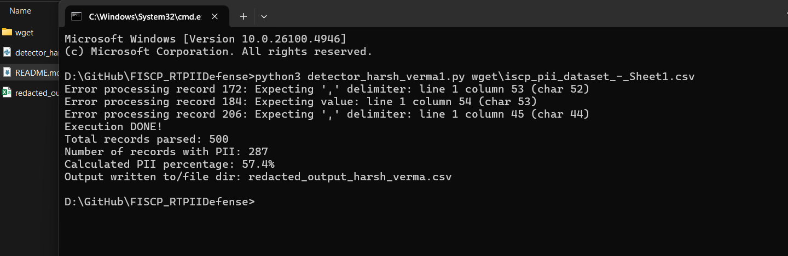
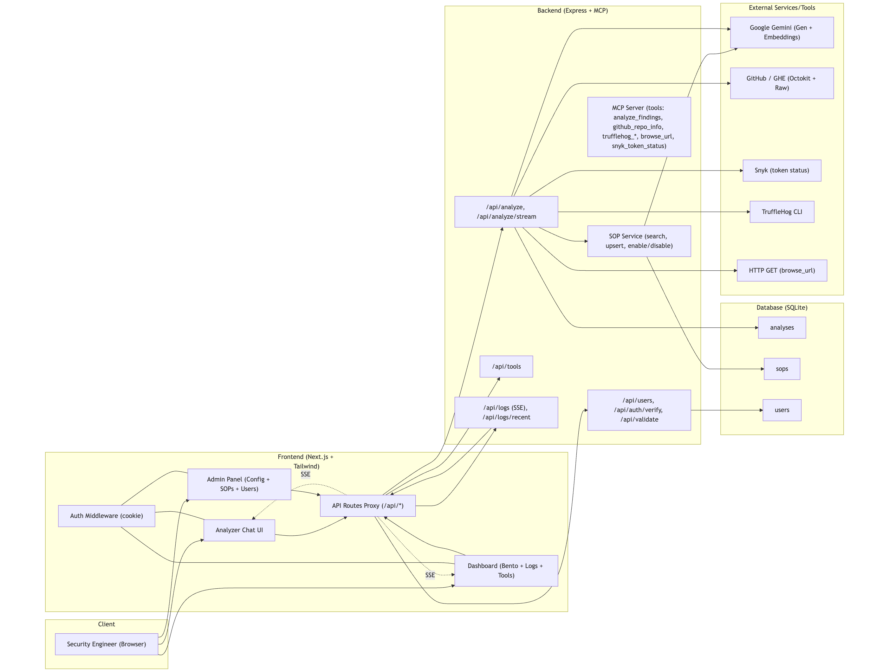

# Flipkart ISCP 
Real-time PII Defense

## How to use
**Prerequisite:** Python3
```
python3 detector_harsh_verma.py <file>
```

## Screenshot

Here's a lightshot of the execution.
> due to errornous data feed, the program is failing to deal few lines. did tried to pre-process the input stream to tackle such error, but it affected the overall detection rate.



## Output

The output file is saved on present working directory with *redacted_output_harsh_verma.csv* (contains my full name as per requirement). And the extracted output from the provided [sample](wget/iscp_pii_dataset_-_Sheet1.csv) can be found at [redacted_output_harsh_verma.csv](redacted_output_harsh_verma.csv)

## Reference


